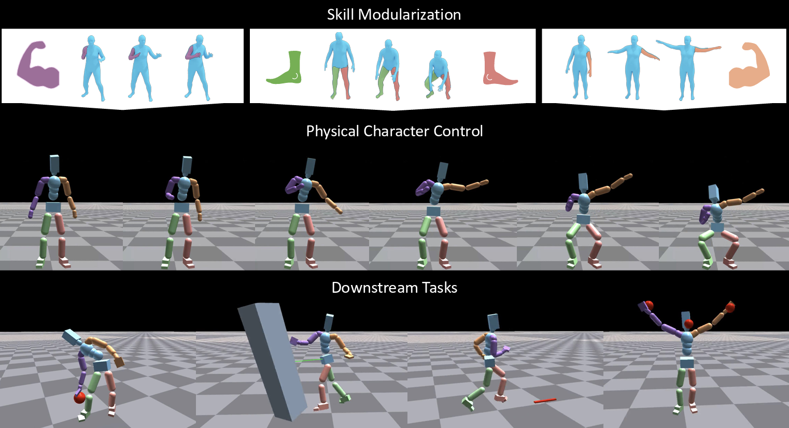
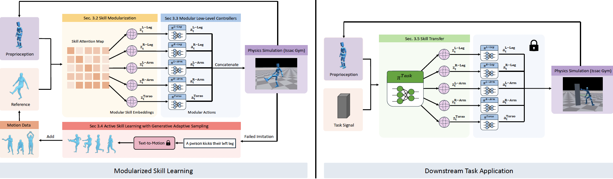

<p align="center">
  <h1 align="center">ModSkill: Physical Character Skill Modularization</h1>
  <h3 align="center">ICCV 2025</h3>
  <h3 align="center"><a href="https://arxiv.org/abs/2502.14140">Paper</a> | <a href="https://yh2371.github.io/modskill/">Project Page</a> </h3>
  <div align="center"></div>
</p>

<div align="center">
  
  
</div>

## BibTeX
If you find our work helpful or use our code, please consider citing:
```bibtex
@inproceedings{huang2025modskill,
  title={Modskill: Physical character skill modularization},
  author={Huang, Yiming and Dou, Zhiyang and Liu, Lingjie},
  booktitle={IEEE/CVF International Conference on Computer Vision},
  year={2025}
  }
```
